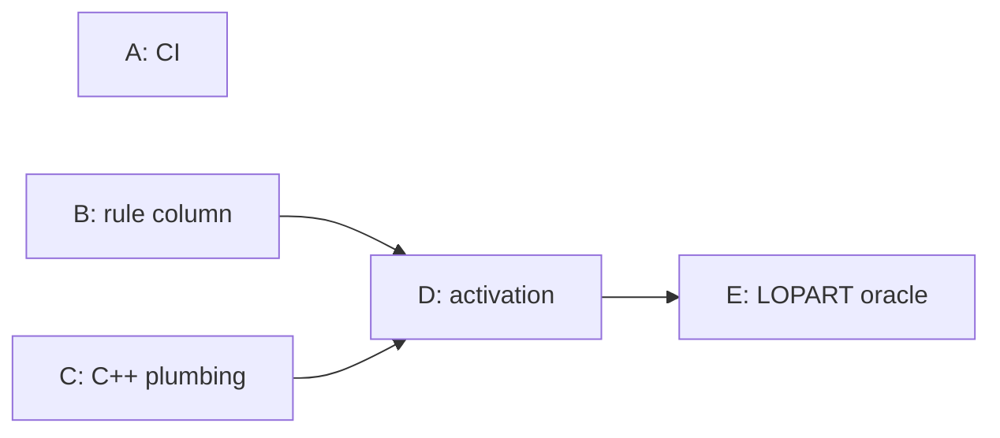

# gfpop GSoC 2026 final report

**William Zhang** · August 23, 2026

[**The blog series**](https://gsoc2026-gfpop.netlify.app/) ·
[**The proposal**](https://github.com/williamzhang7792/gsoc2026-gfpop-proposal-william-zhang) ·
[**Upstream gfpop**](https://github.com/vrunge/gfpop)

> [!NOTE]
> Everything in this report is also recorded on my project blog,
> [gsoc2026-gfpop.netlify.app](https://gsoc2026-gfpop.netlify.app/), one post
> per piece of work, written as it happened. This page is the summary; the
> links throughout point straight into those posts.

This is the final report for my Google Summer of Code 2026 project with the
[R Project for Statistical Computing](https://github.com/rstats-gsoc/gsoc2026/wiki/time-dependent-constraints-in-gfpop):
extending [gfpop](https://github.com/vrunge/gfpop), Vincent Runge's R package
for graph-constrained changepoint detection, so its constraint graph can
change along the signal. It is also the hub for the whole series: each section links
to the post that covers it in detail, starting from
[the very first one](https://gsoc2026-gfpop.netlify.app/posts/week-1-setup/).

## About me

Hi! I'm William. I study statistics and computing at the University of
Waterloo, and I got to spend this summer inside a problem I really like: a
small, sharp piece of optimization with a real package and real users on the
other end. More about me at [williamzhang.me](https://williamzhang.me).

## My mentors

Three people shaped this project, and I want to thank them first:

- [Vincent Runge](https://github.com/vrunge), the author and maintainer of
  gfpop. The package is his, and the code from this project is in his review
  queue on its way to merging.
- Tung Nguyen, my mentor through the design and the mathematics. Every model
  in this report went through his review before it went anywhere else.
- [Toby Hocking](https://github.com/tdhock), whose work on labeled changepoint
  detection, LOPART included, is the foundation this project builds on, and
  who kept a helpful eye on the PRs.

## The project

gfpop finds optimal changepoints under a constraint graph: states and edges
declare which segment-to-segment moves are legal, and the solver returns the
best segmentation that obeys them. Before this project the graph was fixed for
the whole signal. The project makes it time-dependent: each edge carries a rule
id, a per-data-point rule vector says which rule applies where, and the solver
only uses the edges the current rule allows. That one mechanism is what labeled
changepoint detection needs, because a label on a region changes the rules
inside that region. The
[proposal](https://github.com/williamzhang7792/gsoc2026-gfpop-proposal-william-zhang)
has the full plan; the
[opening post](https://gsoc2026-gfpop.netlify.app/posts/week-1-setup/) is the
longer version of this paragraph.

## The goals

Every must-deliver item from the proposal was done by midterm: the midterm
deliverable was the entire core project.
[The midterm hub post](https://gsoc2026-gfpop.netlify.app/posts/midterm-in-five-prs/)
walks the mapping in detail; here is the list and the PR that delivers each
item.

- [x] `Edge(..., rule = ...)`, backward compatible: PR B
- [x] `gfpop(..., rule = ...)`, backward compatible: PR D
- [x] C++ edge filtering by rule: PR D
- [x] Infinity handling in the constraint operators: PR D, and the story there
  turned out [better than planned](https://gsoc2026-gfpop.netlify.app/posts/rule-activation/)
- [x] A LOPART model, oracle-validated against `LOPART::LOPART()`: PR E
- [x] Regression tests, gfpop with no rule identical to current behavior:
  PRs B, C, and D each carry their own
- [x] `R CMD check` passing with no new warnings: PR A, and held by every
  branch since

The second half of the summer went where the proposal's stretch list pointed:
the up-down-with-labels model, and the review process itself.

## What I built

- `Edge(..., rule = k)`: each edge of the constraint graph carries a rule id.
  The default is `NA`, active under every rule, so a graph written today
  behaves exactly as it did before.
- `gfpop(..., rule = <integer vector>)`: a per-data-point rule vector selects
  which edges are active at each step. Calling with no `rule` argument
  reproduces the old behavior exactly.
- In the C++ core: `Edge` carries a `ruleID`, a `Graph::isActive()` helper
  reads it, and the two dynamic-programming minimization loops skip inactive
  edges.
- Two models built on top of the feature, both validated:
  - **LOPART** as a 4-rule, 2-state gfpop graph. The oracle test asserts that
    `gfpop(rule = ...)` reproduces `LOPART::LOPART()` exactly on shared data:
    the same changepoints, the same segment means, the same loss.
  - **Up-down with labels** for peak detection: a 6-rule, 4-state graph with
    peakStart, peakEnd, and noPeaks labels. No R package implements this
    model, so there is no oracle to check against; it is validated
    structurally instead. Exactly one change per positive label, zero per
    negative label, and an all-unlabeled run reproduces
    `graph(type = "updown")` exactly.

## The five PRs

The feature was handed over as five stacked pull requests, A through E, each
small enough to review in a sitting, each backward compatible by construction,
with the trunk green from first to last.
[How to hand a maintainer a whole feature](https://gsoc2026-gfpop.netlify.app/posts/midterm-in-five-prs/)
is the full story of the slicing; the short version is the diamond.

*PR A stands alone, while PRs B and C converge on D, which leads to E.*

| Piece | Write-up | Code | Status |
|---|---|---|---|
| A: CI, `R-CMD-check` on three platforms | [the first neutral reader](https://gsoc2026-gfpop.netlify.app/posts/adding-ci/) | [#20](https://github.com/vrunge/gfpop/pull/20) | In review upstream |
| B: the `rule` column in the R API | [backward compatible by default](https://gsoc2026-gfpop.netlify.app/posts/rule-column/) | [#21](https://github.com/vrunge/gfpop/pull/21) | In review upstream, a draft to settle the API shape first |
| C: inert C++ plumbing | [inert by design](https://gsoc2026-gfpop.netlify.app/posts/cpp-rule-plumbing/) | [diff](https://github.com/williamzhang7792/gfpop/compare/feat/rule-column...feat/cpp-rule-infra) | Ready, queued behind B |
| D: activation, `gfpop(rule = ...)` | [the hard part was free](https://gsoc2026-gfpop.netlify.app/posts/rule-activation/) | [diff](https://github.com/williamzhang7792/gfpop/compare/feat/cpp-rule-infra...feat/activate-rule) | Ready, queued behind B |
| E: the LOPART model and oracle test | [gfpop reproduces LOPART, exactly](https://gsoc2026-gfpop.netlify.app/posts/lopart-oracle/) | [diff](https://github.com/williamzhang7792/gfpop/compare/feat/activate-rule...feat/lopart) | Ready, queued behind B |
| Beyond midterm: up-down with labels | [design note](https://github.com/williamzhang7792/gfpop/blob/design/updown-labels/design/updown-labels.md) | [diff](https://github.com/williamzhang7792/gfpop/compare/feat/lopart...feat/updown-labels) | On this fork, green |
| The full stack assembled | | [prototype branch](https://github.com/williamzhang7792/gfpop/tree/prototype/time-dependent-constraints) | Green, LOPART oracle included |

All five PRs are written, tested, and under review. Tung has reviewed the
mathematics behind them; the code now waits on Vincent, whose package this is,
to work through the queue. C, D, and E sit behind B on purpose: the API surface
is the part most worth arguing about, so nothing downstream of it should ask
for review against a moving target. Each diff link above shows exactly that
piece's changes, because the branches stack linearly in this repository.

## What was hard

- **The part I worried about most was free.** The proposal flagged infinity
  handling in the cost operators, about 200 lines each, as the main risk. They
  needed zero changes: skipping an inactive edge leaves the destination at the
  +Inf the solver already initializes, and gfpop's existing infinity
  propagation does the rest.
  [The activation post](https://gsoc2026-gfpop.netlify.app/posts/rule-activation/)
  says it plainly, because it is worth saying plainly: I budgeted the most
  worry for the part that cost none.
- **The genuinely hard part was semantics, not code.** A single label-end
  index cannot both force a change and release the lock state. The up-down
  model resolves this with peakStart and peakEnd labels, each meaning exactly
  one change of known direction, with the end rules routing the forced change
  directly into the released state. It is the same trick LOPART's end rule
  uses, rediscovered the hard way.
- **CI earned its keep on day one.** The
  [first neutral reader](https://gsoc2026-gfpop.netlify.app/posts/adding-ci/)
  surfaced a network install hiding inside the test suite, and the fix
  belonged in the package, not the YAML.

## Plan changes

The plan mostly held. Three changes are worth recording:

- PR D was expected to be the hard one and was not, so the budget moved to the
  up-down model, which the proposal had listed as stretch.
- The dependency graph is a diamond, but the build order is a straight line:
  C stacks on B because C's inert-equality test is cleaner when it can use B's
  API. When the difference is one convenience edge, take the simpler build
  order.
- C, D, and E stayed staged rather than opening upstream immediately. An API
  still under discussion should not have three PRs leaning on it.

## What's next

1. Get A through E merged as Vincent works through the review queue; each
   piece is small on purpose.
2. Promote `lopart_graph()` and `updown_labels_graph()` from test helpers to
   exported, documented constructors.
3. The capstone vignette, with a filmstrip of the graph changing along the
   signal.
4. Performance benchmarks from a thousand points to a million.
5. The stretch goal that remains: Poisson loss with labels.

And, of course, the merging itself. The stack was built so review could go one
honest piece at a time, and over the coming months I hope to watch it go in
the same way.

## The series

1. [Starting GSoC 2026: the project and how this blog works](https://gsoc2026-gfpop.netlify.app/posts/week-1-setup/)
2. [How to hand a maintainer a whole feature: the midterm in five PRs](https://gsoc2026-gfpop.netlify.app/posts/midterm-in-five-prs/)
3. [Adding CI to gfpop: the first neutral reader](https://gsoc2026-gfpop.netlify.app/posts/adding-ci/)
4. [Adding a rule column to gfpop: backward compatible by default](https://gsoc2026-gfpop.netlify.app/posts/rule-column/)
5. [Wiring the rule into gfpop's C++ core: inert by design](https://gsoc2026-gfpop.netlify.app/posts/cpp-rule-plumbing/)
6. [Activating the rule in gfpop's solver: the hard part was free](https://gsoc2026-gfpop.netlify.app/posts/rule-activation/)
7. [The LOPART oracle: gfpop reproduces LOPART, exactly](https://gsoc2026-gfpop.netlify.app/posts/lopart-oracle/)

Thanks for reading, and thanks again to Tung, Vincent, and Toby. This was a
good summer. If you want to say hi, I'm at
[williamzhang.me](https://williamzhang.me).
