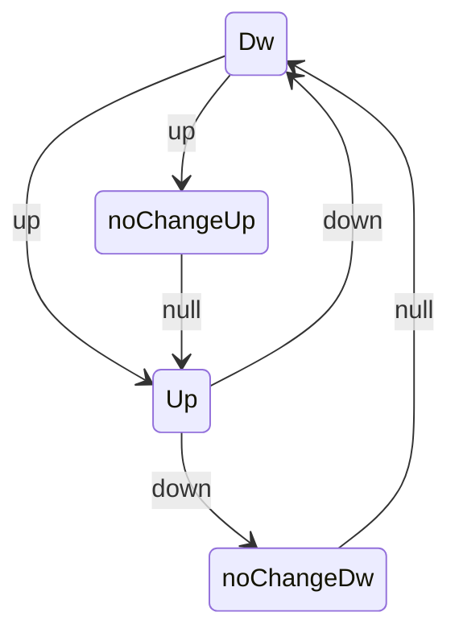

# Up-down with labels: 6-rule / 4-state design

Design note for the second time-dependent model (proposal, "Up-Down with
Labels", 6 rule IDs / 4 states). This is spec only, no code. It generalizes the
LOPART model (4 rules / 2 states, see `tests/testthat/test-lopart.R`) to a
peak-detection setting that no current R package offers, and sets up the July 6
build so it's mechanical: every matrix cell becomes one `Edge(..., rule = k)`,
and the label mapping becomes one helper.

## Background

Standard up-down in gfpop is 2 states and 4 edges (`R/paperGraphs.R`):

- `Dw -> Dw` null, `Up -> Up` null
- `Dw -> Up` up (rise, penalized), `Up -> Dw` down (fall, penalized)
- `StartEnd(start = "Dw", end = "Dw")`

Changes must alternate, so a peak is one `up` then one `down`.

LOPART's rule pattern (the thing we're doubling):

- rule 1 unlabeled: standard model (`normal` null + std)
- rule 2 in positive: at most one change (`normal -> noChange` via std, then null lock)
- rule 3 end of positive: release the lock (`noChange -> normal` null, `normal -> normal` std)
- rule 4 in negative: null only, no change

There is no oracle for up-down + labels (LOPART is Gaussian, no up-down
constraint). So validation is structural, not a match against another package.

## 1. States (4)

- `Dw` - at baseline / valley, changes still allowed.
- `Up` - elevated / on a peak, changes still allowed.
- `noChangeUp` - risen, and the up-phase's one allowed change is spent (null lock).
- `noChangeDw` - fallen, and the down-phase's one allowed change is spent (null lock).

The two `noChange*` states are the up-down analog of LOPART's single `noChange`:
they record "the one change for this phase has been used" so the null self-loop
is the only remaining move until a rule releases the lock.

## 2. Candidate 6-rule design (to pressure-test)

Core idea: a positive label region should contain exactly one peak = one `up`
then one `down`. A peak has two events, so LOPART's `(in, end)` pair for its
single change is *doubled* across the two phases of the peak:

- up-phase: in (rule 3), end (rule 4)
- down-phase: in (rule 5), end (rule 6)

That is 4 positive rules, plus unlabeled (rule 1) and negative (rule 2) = 6.

State x rule edge matrix, one bullet per rule (each edge is `state1 -> state2 type`):

- Rule 1 - Unlabeled (= standard up-down)
  - `Dw -> Dw` null
  - `Up -> Up` null
  - `Dw -> Up` up
  - `Up -> Dw` down
- Rule 2 - In negative label (flat, no change)
  - `Dw -> Dw` null
  - `Up -> Up` null
- Rule 3 - In positive label, up-phase (at most one up-change)
  - `Dw -> Dw` null
  - `Dw -> noChangeUp` up
  - `noChangeUp -> noChangeUp` null
- Rule 4 - End of up-phase (count the rise, release the lock)
  - `Dw -> noChangeUp` up
  - `noChangeUp -> Up` null
- Rule 5 - In positive label, down-phase (at most one down-change)
  - `Up -> Up` null
  - `Up -> noChangeDw` down
  - `noChangeDw -> noChangeDw` null
- Rule 6 - End of down-phase (count the fall, release the lock)
  - `Up -> noChangeDw` down
  - `noChangeDw -> Dw` null

`StartEnd`: start `Dw`, end `Dw` (a peak returns to baseline).

Traversal of one positive peak region: start `Dw`, rules 3/4 take `Dw -> Up`
(exactly one rise, locked in between), rules 5/6 take `Up -> Dw` (exactly one
fall). After the region we are back in `Dw` and rule 1 resumes. The lock states
are what cap each phase at a single change.

Union of all edges across rules (states + transition types):

## 3. Label -> rule-vector mapping

Generalizes `lopart_rule_vec(n, labels)`. Input: data length `n` and a labels
table of regions; output: length-`n` integer rule vector. Assignment:

- unlabeled positions -> 1
- negative label region -> 2
- positive label, up-phase interior -> 3, up-phase end index -> 4
- positive label, down-phase interior -> 5, down-phase end index -> 6

The one thing this mapping needs from the label geometry is where the up-phase
ends and the down-phase begins inside a positive region (see Open Questions).
Peak-detection label sets typically carry this as separate `peakStart` /
`peakEnd` label types rather than a single positive span.

## 4. Filmstrip

Per the proposal's visualization TODO: a 6-panel filmstrip, one panel per rule,
each drawing only that rule's active subgraph over the 4 states (inactive edges
greyed out or omitted). This is the design's headline figure and later feeds the
capstone vignette's visualization. The section should sketch the 6 panels using
the matrix above (which states/edges are lit in each) so July 6's `plotModel`
extension has a target to reproduce.

## 5. Validation / consistency checks (no oracle)

Acceptance criteria the design must meet, carried into July 6 as tests:

- Backward-compat: an all-rule-1 vector reproduces `graph(type = "updown")`
  exactly (same changepoints, means, cost) - the equivalence check, analogous to
  the LOPART all-unlabeled test.
- Structural invariants on synthetic labeled peaks: exactly one up + one down per
  positive region, zero changes per negative region.
- Each per-rule active-edge set is a valid, reachable subgraph consistent with
  `StartEnd` (no orphan states, no dead ends).
- Alternation preserved: within a peak, `up` precedes `down`.
- Sort invariant: edges remain orderable by `(rule, state2, penalty)` so the
  rule-to-edge lookup stays contiguous after `graphReorder()`. Flagged here for
  July 6, not solved in this note.

## 6. Open questions (resolve before July 6)

- Peak = two changepoints (up + down) vs the proposal's "exactly one changepoint
  per positive label" phrasing. The invariant wording needs to match the
  two-event peak, or the model needs to target a single event (e.g. only the
  rise) per positive label.
- End-rule semantics at a single index. A phase-end index cannot both force the
  change and release the lock in the same step: if we are still in `Dw` at the
  up-end index, rule 4 rises into `noChangeUp` but cannot also release to `Up`.
  This strongly implies the up-phase and down-phase each need their own
  end index, i.e. positive regions must be delimited as `peakStart` / `peakEnd`
  rather than one span. Decide the label geometry, then finalize rules 4 and 6.
- Force vs allow: should rules 4/6 hard-require the change (peak must exist) or
  merely permit it? This changes whether a positive label can be "empty".
- Confirm 4 states suffice for the chosen semantics (the proposal fixes 4; verify
  no 5th state is needed once the end-rule question is settled).

## 7. Handoff to July 6

Direct mapping into the build:

- Each matrix cell -> one `Edge(state1, state2, type, rule = k, penalty = lambda)`
  in an `updown_labels_graph(lambda)` constructor, plus `StartEnd("Dw", "Dw")`.
- Section 3 -> an `updown_labels_rule_vec(n, labels)` helper.
- Section 5 -> the testthat structural tests (equivalence to `type = "updown"`,
  per-region invariants).

This is the first model that exercises `operatorUp` / `operatorDw` and
rule-gated backtracking (LOPART used only null/std edges), so the July 6 build is
where the proposal's operator-infinity and backtracking obstacles first get
tested.
