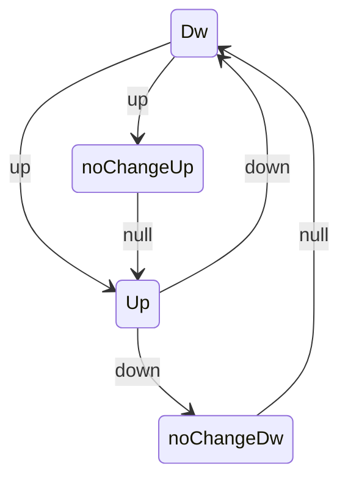

# Up-down with labels: 6-rule / 4-state design

Design note for the second time-dependent model (proposal, "Up-Down with
Labels", 6 rule IDs / 4 states). This is spec only, no code. It generalizes the
LOPART model (4 rules / 2 states, see `tests/testthat/test-lopart.R`) to a
peak-detection setting that no current R package offers, and sets up the July 6
build so it's mechanical: every matrix cell becomes one `Edge(..., rule = k)`,
and the label mapping becomes one helper.

## Background

Standard up-down in gfpop is 2 states and 4 edges (`R/paperGraphs.R`):

- `Dw -> Dw` null, `Up -> Up` null
- `Dw -> Up` up (rise, penalized), `Up -> Dw` down (fall, penalized)
- `StartEnd(start = "Dw", end = "Dw")`

Changes must alternate, so a peak is one `up` then one `down`.

LOPART's rule pattern (the thing we're doubling):

- rule 1 unlabeled: standard model (`normal` null + std)
- rule 2 in positive: at most one change (`normal -> noChange` via std, then null lock)
- rule 3 end of positive: release the lock (`noChange -> normal` null, `normal -> normal` std)
- rule 4 in negative: null only, no change

There is no oracle for up-down + labels (LOPART is Gaussian, no up-down
constraint). So validation is structural, not a match against another package.

## 1. States (4)

- `Dw` - at baseline / valley, changes still allowed.
- `Up` - elevated / on a peak, changes still allowed.
- `noChangeUp` - risen, and the peakStart's one allowed change is spent (null lock).
- `noChangeDw` - fallen, and the peakEnd's one allowed change is spent (null lock).

The two `noChange*` states are the up-down analog of LOPART's single `noChange`:
they record "the one change for this phase has been used" so the null self-loop
is the only remaining move until a rule releases the lock.

## 2. The 6-rule design (peakStart / peakEnd)

Core idea: use the standard genomic peak-detection labels, where each positive
label asserts exactly one change of a known direction - a `peakStart` region
holds one `up`, a `peakEnd` region holds one `down`. So the model is two copies
of LOPART's `(in, end)` pair, one per direction:

- peakStart: in (rule 3), end (rule 4)
- peakEnd: in (rule 5), end (rule 6)

That is 4 positive rules, plus unlabeled (rule 1) and negative/noPeaks
(rule 2) = 6. Each labeled region then contains exactly one changepoint, which
matches the proposal's invariant wording directly.

State x rule edge matrix, one bullet per rule (each edge is `state1 -> state2 type`):

- Rule 1 - Unlabeled (= standard up-down)
  - `Dw -> Dw` null
  - `Up -> Up` null
  - `Dw -> Up` up
  - `Up -> Dw` down
- Rule 2 - In noPeaks label (flat, no change)
  - `Dw -> Dw` null
  - `Up -> Up` null
- Rule 3 - In peakStart (at most one up-change)
  - `Dw -> Dw` null
  - `Dw -> noChangeUp` up
  - `noChangeUp -> noChangeUp` null
- Rule 4 - End of peakStart (force the up, land in Up)
  - `Dw -> Up` up
  - `noChangeUp -> Up` null
- Rule 5 - In peakEnd (at most one down-change)
  - `Up -> Up` null
  - `Up -> noChangeDw` down
  - `noChangeDw -> noChangeDw` null
- Rule 6 - End of peakEnd (force the down, land in Dw)
  - `Up -> Dw` down
  - `noChangeDw -> Dw` null

`StartEnd`: start `Dw`, end `Dw` (a peak returns to baseline).

The `noChangeUp` / `noChangeDw` states are entered only mid-region (rules 3/5)
to lock out a second change. The end rules (4/6) never enter a lock state: the
forced change lands directly in the released state (`Dw -> Up`, `Up -> Dw`), so
the phase-end index ends in `Up` (peakStart) or `Dw` (peakEnd) whether or not
the change already happened - the trick LOPART uses to avoid a single index
doing two jobs. A peakStart region traverses `Dw -> Up` (exactly one rise); a
later peakEnd region traverses `Up -> Dw` (exactly one fall). Between them, and
after, rule 1 resumes from `Up` or `Dw` respectively.

Union of all edges across rules (states + transition types):

## 3. Label -> rule-vector mapping

Generalizes `lopart_rule_vec(n, labels)`. Input: data length `n` and a labels
table of regions; output: length-`n` integer rule vector. Assignment:

- unlabeled positions -> 1
- noPeaks label region -> 2
- peakStart region: interior -> 3, last index -> 4
- peakEnd region: interior -> 5, last index -> 6

Labels are a `data.frame(start, end, type)` with `type` in {`peakStart`,
`peakEnd`, `noPeaks`}. No sub-phase split is needed: each label is a single
region with a known direction, so the mapping is a direct generalization of
`lopart_rule_vec()`.

## 4. Filmstrip

Per the proposal's visualization TODO: a 6-panel filmstrip, one panel per rule,
each drawing only that rule's active subgraph over the 4 states (inactive edges
greyed out or omitted). This is the design's headline figure and later feeds the
capstone vignette's visualization. The section should sketch the 6 panels using
the matrix above (which states/edges are lit in each) so July 6's `plotModel`
extension has a target to reproduce.

## 5. Validation / consistency checks (no oracle)

Acceptance criteria the design must meet, carried into July 6 as tests:

- Backward-compat: an all-rule-1 vector reproduces `graph(type = "updown")`
  exactly (same changepoints, means, cost) - the equivalence check, analogous to
  the LOPART all-unlabeled test.
- Structural invariants on synthetic labeled peaks: exactly one changepoint per
  positive label (an up in each peakStart, a down in each peakEnd), zero changes
  per noPeaks region.
- Each per-rule active-edge set is a valid, reachable subgraph consistent with
  `StartEnd` (no orphan states, no dead ends).
- Alternation preserved: within a peak, `up` precedes `down`.
- Sort invariant: edges remain orderable by `(rule, state2, penalty)` so the
  rule-to-edge lookup stays contiguous after `graphReorder()`. Flagged here for
  July 6, not solved in this note.

## 6. Resolved decisions and remaining questions

Resolved (drove the design above):

- Labels are peakStart / peakEnd / noPeaks, each a single region of known
  direction, so a positive label holds exactly one changepoint - matching the
  proposal's invariant. (Was: one positive span with two events.)
- The end rules (4/6) route the forced change straight to the released state
  (`Dw -> Up`, `Up -> Dw`) and never into a lock, so a single end index does one
  job. (Was: the single-index conflict.)
- 4 states suffice: the lock states are entered only mid-region and exited by the
  end rule, so no 5th state is needed.

Still open:

- Force vs allow. Rules 4/6 as written force the change (the end index has no
  null self-loop keeping you in `Dw`/`Up`), so a labeled region cannot be empty.
  That is the intended peak-detection semantics, but if "label present, no peak"
  must be representable, add a null self-loop to the end rule and drop the hard
  requirement.

## 7. Handoff to July 6

Direct mapping into the build:

- Each matrix cell -> one `Edge(state1, state2, type, rule = k, penalty = lambda)`
  in an `updown_labels_graph(lambda)` constructor, plus `StartEnd("Dw", "Dw")`.
- Section 3 -> an `updown_labels_rule_vec(n, labels)` helper.
- Section 5 -> the testthat structural tests (equivalence to `type = "updown"`,
  per-region invariants).

This is the first model that exercises `operatorUp` / `operatorDw` and
rule-gated backtracking (LOPART used only null/std edges), so the July 6 build is
where the proposal's operator-infinity and backtracking obstacles first get
tested.
